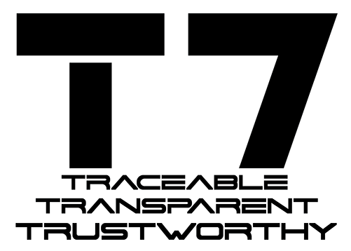

## Workshop on Provenance for Transparent Research

The public and the press already expect to assess the trustworthiness of research relevant to pressing social and public health issues in terms of transparency. While widely recognized as a critical component of research reproducibility in principle, __the promise of making research fully transparent---and scientific claims easier to evaluate---via reliable provenance has yet to be realized in full__. In particular, it is still far from routine for researchers in the natural, social, and data sciences to assess the trustworthiness of reported results using automatically captured provenance information.

This workshop aims to engage [Provenance Week 2021]({{ site.baseurl }}/) attendees in a focused conversation about how methods for automated provenance capture, storage, query, inference, and visualization can make research more transparent and the trustworthiness of results easier to evaluate, both by other researchers and by the public. 

In brief presentations speakers will __propose actionable definitions__ of terms such as *transparent*, *trustworthy*, and *traceable*; __identify needs of research communities__ and other stakeholders; __prioritize desiderata__ for real-world system implementations; and __highlight remaining challenges__. 

Everyone who attends the T7 Workshop is considered a participant. __All attendees__ will be invited to comment and __contribute__ their own __definitions, priorities, and requirements__ in real time. The suggestions will be __ranked__ both by __generality across research domains__ *and* __specificity to particular domains__. The resulting recommendations and rankings will be included in a workshop report. 

We ask that everyone planning to attend please read the [Instructions for All T7 Workshop Participants]({{ site.baseurl }}/t7-details) to make the workshop as productive as possible.

### Seven T-Words: Principles of Transparent Research

A central aim of the workshop is to move beyond the debates around the R-words (*reproducible*, *replicable*, *repeatable*, etc) to focus on the elements of excellent research that the R-words ultimately represent and that automated provenance management can help deliver:

- *Trustworthy* publications, results, and recommendations
- *Transparent* research processes that facilitate review and assessment
- *True* records of the methods and processes yielding research artifacts
- *Traceable* derivation lineages of individual data products
- *Trials* demonstrated to rigorously enact well-defined study designs
- *Tests* of hypotheses, protocols, and conclusions that are readily reviewed 
- *Timely* application of research outcomes to address pressing problems

### Suggested Themes for Presentation and Discussion
- Significance of research transparency in addressing 21st-century existential threats
- Actionable definitions of *transparency*, *traceability*, and related T-words 
- R-words meet T-words: how reproducibility enables transparency and vice versa
- Transparent research objects: standards and interoperability
- Provenance in support of FATE and FAIR principles
- Needles in a haystack--querying and visualizing lineages of particular research products
- What can I ask? Vocabularies and query languages for delivering traceability
- Attachment issues. Associating domain-specific concepts with computational artifacts
- Unsolved problems and other opportunities for collaboration and funding

### Keynote Speaker

We are pleased to announce [Lars Vilhuber](http://lars.vilhuber.com/) as keynote speaker for the T7 workshop. Dr. Vilhuber is Executive Director of the Labor Dynamics Institute and Senior Research Associate in the ILR School at Cornell University. He serves as Data Editor for the American Economic Association where he has been central to the implementation of policies and procedures for verification of the reproducibility of computational research published in AEA journals. Dr. Vilhuber is also Managing Editor of the *Journal of Privacy and Confidentiality*, Chair of the American Statistical Association's Committee on Privacy and Confidentiality, and member of various boards of restricted-access data centers, giving him great insight into the challenges and advantages of transparent and reproducible science.

In his talk "Principles of Transparent Research: Implementation Challenges" he will discuss the role of journal reproducibility checks in improving research transparency as well as the many challenges faced in implementation.

### Workshop Format
T7 will be held Thursday, **July 22, 2021** and will be fully Zoom-based for worldwide participation. Speakers will make brief presentations in support of the insights they share. All participants will propose issues, definitions, desiderata, and success criteria via Zoom chat. Zoom polls will be used to score and rank these contributions anonymously. 

For more detailed information about the workshop format please see the [Instructions for All T7 Workshop Participants]({{ site.baseurl }}/t7-details).

### Call for Abstracts
We invite submissions of 1-page abstracts on topics relevant to the workshop. Abstracts should highlight key points the speaker plans to submit to the audience for discussion and ranking. To submit an abstract please select the **Workshop on Provenance for Transparent Research** track in [EasyChair](https://easychair.org/conferences/?conf=pw2021). 

### Important Dates
- **T7 Abstract Submission**: May 31st, 2021
- **T7 Speaker Notification**: June 14th, 2021
- **Provenance Week**: July 19-22, 2021
- **T7 Convenes**: **July 22, 2021** (Thursday)

### Organizers

<ul>
  
  <li><b>{{ chair.name }}</b> (<it>{{ chair.affiliation }}</it>)</li>
  
</ul>

### Be Informed

We encourage everyone to __[subscribe to the T7 mailing list](https://t7.tmcphillips.dev/mailing-list)__ to learn when registration opens and to receive other updates by email.

### More Information

We ask that everyone who plans to attend to please read the [Instructions for All T7 Workshop Participants]({{ site.baseurl }}/t7-details) carefully.

Please contact [Tim McPhillips](mailto:tmcphill@illinois.edu) with any questions.

  

